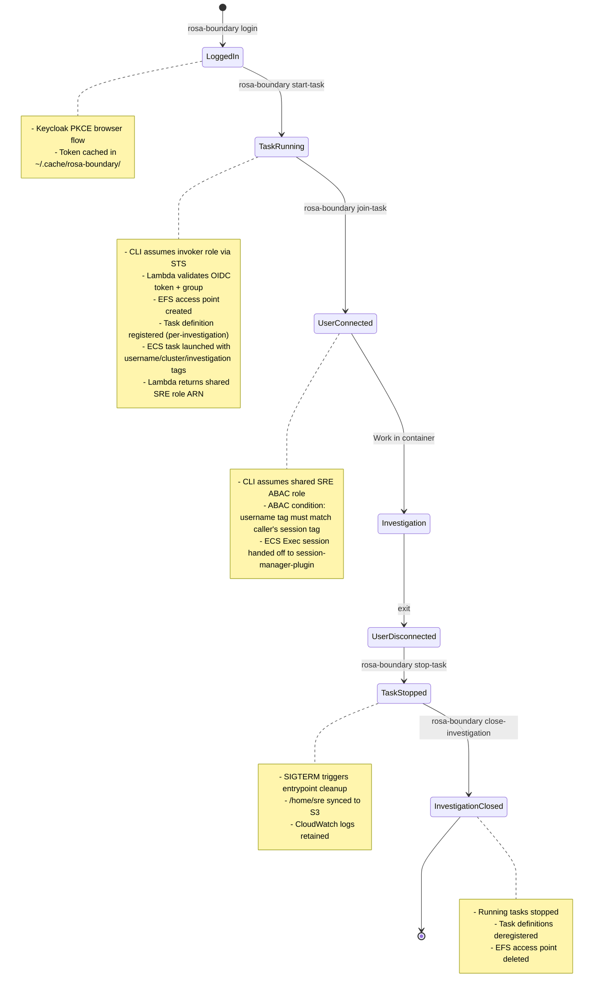

# Investigation Workflow

## Overview

This runbook describes the complete investigation lifecycle using the `rosa-boundary` CLI with
Lambda-based OIDC authentication, from creation through access to closure. The CLI wraps all
AWS API calls and handles OIDC token caching, role assumption, and ECS Exec session hand-off.

## Workflow Diagram



## Prerequisites

```bash
# Build the CLI
make build-cli

# Verify session-manager-plugin is installed (required for join-task)
session-manager-plugin --version

# Confirm AWS credentials
aws sts get-caller-identity
```

## Phase 1: Authenticate

```bash
./bin/rosa-boundary login \
  --keycloak-url https://auth.redhat.com/auth \
  --realm EmployeeIDP \
  --client-id rosa-boundary-sre
```

What it does:
- Opens a browser for Keycloak PKCE authentication
- Caches the OIDC token at `~/.cache/rosa-boundary/token.json`
- Token is reused for subsequent CLI commands (TTL: ~4 minutes)

## Phase 2: Start Investigation

```bash
./bin/rosa-boundary start-task \
  --cluster-id <cluster-id> \
  --investigation-id <investigation-id> \
  --lambda-function-name rosa-boundary-dev-create-investigation \
  --invoker-role-arn arn:aws:iam::660777614061:role/rosa-boundary-dev-lambda-invoker \
  --ecs-cluster rosa-boundary-dev \
  --region us-east-2
```

Optional flags:
```
  --task-timeout 3600     # seconds; 0 = no timeout (default: 3600)
  --oc-version 4.20       # OpenShift CLI version to lock (default: latest)
```

What it does:
1. **CLI assumes the invoker role** via STS (two-step: automation creds → invoker role)
2. **Invokes the create-investigation Lambda** with the cached OIDC token
3. **Lambda validates** the token against Keycloak JWKS and checks `ai-sd-sre` group membership
4. **Lambda creates an EFS access point**: `/<cluster-id>/<investigation-id>/`
5. **Lambda registers a per-investigation task definition** with locked OC version and pre-set env vars
6. **Lambda launches the ECS task** tagged with `username`, `cluster_id`, `investigation_id`, `deadline`
7. **Lambda returns the shared SRE role ARN** and task ARN
8. CLI prints connection command

Output includes the task ID — save it for join/stop/close steps.

## Phase 3: List Tasks

```bash
./bin/rosa-boundary list-tasks \
  --ecs-cluster rosa-boundary-dev \
  --region us-east-2
```

Shows: task ID, status, cluster, investigation ID, username, start time.

## Phase 4: Connect to Container

```bash
./bin/rosa-boundary join-task <task-id> \
  --ecs-cluster rosa-boundary-dev \
  --region us-east-2
```

What it does:
1. Assumes the shared SRE ABAC role (scoped by `aws:PrincipalTag/username` ABAC condition)
2. Calls `ecs:ExecuteCommand` — the IAM policy only allows exec on tasks where `ecs:ResourceTag/username` matches the caller's session tag
3. Waits ~8 seconds for the container exec agent to open its data channel
4. Replaces the current process with `session-manager-plugin` for a seamless terminal

Inside the container (as `sre` user):
```bash
whoami              # sre
echo $CLUSTER_ID    # <cluster-id>
echo $INVESTIGATION_ID  # <investigation-id>
claude --version    # Claude Code via Bedrock
oc version --client # OpenShift CLI (locked to investigation version)
```

All files in `/home/sre` persist to EFS across task restarts for the same investigation.

## Phase 5: Stop Task (Triggers S3 Sync)

```bash
./bin/rosa-boundary stop-task <task-id> \
  --ecs-cluster rosa-boundary-dev \
  --region us-east-2
```

What it does:
1. Sends SIGTERM to the ECS task
2. Container entrypoint cleanup runs `aws s3 sync /home/sre/ s3://...`
3. S3 path is auto-generated: `s3://<bucket>/<cluster-id>/<investigation-id>/<date>/<task-id>/`
4. Task transitions to STOPPED

## Phase 6: Close Investigation

```bash
./bin/rosa-boundary close-investigation \
  --cluster-id <cluster-id> \
  --investigation-id <investigation-id> \
  --efs-filesystem-id fs-089982673ac88b7d8 \
  --ecs-cluster rosa-boundary-dev \
  --region us-east-2
```

What it does:
1. Verifies no running tasks remain for this investigation
2. Deregisters all per-investigation task definition revisions
3. Deletes the EFS access point (EFS data at `/<cluster-id>/<investigation-id>/` is preserved on the filesystem)

## Complete Example

```bash
# Set common variables
CLUSTER_ID="rosa-prod-01"
INV_ID="INV-456"
REGION="us-east-2"
ECS_CLUSTER="rosa-boundary-dev"
LAMBDA_FN="rosa-boundary-dev-create-investigation"
INVOKER_ROLE="arn:aws:iam::660777614061:role/rosa-boundary-dev-lambda-invoker"
EFS_ID="fs-089982673ac88b7d8"

# 1. Authenticate
./bin/rosa-boundary login \
  --keycloak-url https://auth.redhat.com/auth \
  --realm EmployeeIDP \
  --client-id rosa-boundary-sre

# 2. Start investigation (save TASK_ID from output)
./bin/rosa-boundary start-task \
  --cluster-id "$CLUSTER_ID" \
  --investigation-id "$INV_ID" \
  --lambda-function-name "$LAMBDA_FN" \
  --invoker-role-arn "$INVOKER_ROLE" \
  --ecs-cluster "$ECS_CLUSTER" \
  --region "$REGION"

TASK_ID="<from output>"

# 3. Connect
./bin/rosa-boundary join-task "$TASK_ID" \
  --ecs-cluster "$ECS_CLUSTER" \
  --region "$REGION"

# (exit container when done)

# 4. Stop task
./bin/rosa-boundary stop-task "$TASK_ID" \
  --ecs-cluster "$ECS_CLUSTER" \
  --region "$REGION"

# 5. Close investigation
./bin/rosa-boundary close-investigation \
  --cluster-id "$CLUSTER_ID" \
  --investigation-id "$INV_ID" \
  --efs-filesystem-id "$EFS_ID" \
  --ecs-cluster "$ECS_CLUSTER" \
  --region "$REGION"
```

## Authorization Model

All SREs share a single IAM role (`rosa-boundary-dev-sre-shared`). Access is scoped at runtime by ABAC:

- Lambda tags tasks with `username: <preferred-username>` at launch
- Lambda calls `sts:TagSession` to inject `username` into the caller's STS session
- The shared role policy allows `ecs:ExecuteCommand` only when `ecs:ResourceTag/username == aws:PrincipalTag/username`
- Cross-user task access is prevented at IAM policy level without per-user roles

## Viewing Session Logs

All ECS Exec sessions are streamed to CloudWatch in real-time with KMS encryption:

```bash
# List recent sessions
aws logs describe-log-streams \
  --log-group-name "/ecs/rosa-boundary-dev/ssm-sessions" \
  --order-by LastEventTime --descending \
  --max-items 10 \
  --region us-east-2

# Tail all sessions live
aws logs tail "/ecs/rosa-boundary-dev/ssm-sessions" --follow --region us-east-2

# View specific session
aws logs get-log-events \
  --log-group-name "/ecs/rosa-boundary-dev/ssm-sessions" \
  --log-stream-name "ecs-execute-command-<SESSION_ID>" \
  --region us-east-2
```

## Troubleshooting

### Token cache stale
```bash
rm ~/.cache/rosa-boundary/token.json
./bin/rosa-boundary login ...
```

### AccessDeniedException on join-task
- Cause: You are not the user who created the task (ABAC tag mismatch) or the task has no `username` tag
- Verify: `aws ecs describe-tasks --cluster rosa-boundary-dev --tasks <task-id> --query 'tasks[0].tags'`

### Lambda returns 403 Forbidden
- Cause: Caller's OIDC group claim does not include `ai-sd-sre`
- Verify group membership in Keycloak; contact the Keycloak admin

### session-manager-plugin: connection drops immediately
- Cause: Container exec agent hasn't opened its WebSocket yet
- The CLI waits 8 seconds by default; if it still fails, the task may not have ECS Exec enabled

## Related

- [Troubleshooting](troubleshooting.md)
- [User Access Guide](user-access-guide.md)
- [AWS IAM Policies](../configuration/aws-iam-policies.md)
